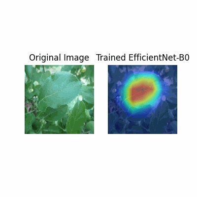

# Visual-Efficientnets

## 数据集介绍

### 数据集概况

本项目使用的Plant Pathology-2021包含**12个类别**，每个类别对应不同的叶片病害类型。然而，不同类别之间存在标签重复（例如，`scab`在多个类别中出现），这增加了模型训练的复杂性。因此，我们对数据集进行了类别合并，将原有的12个类别转换为**6个类别**，并将其视为一个**多标签分类**问题。

### 类别说明

经过合并后的6个类别如下：

- scab
- healthy
- frog_eye_leaf_spot
- rust
- complex
- powdery_mildew

每个类别通过**One-Hot编码**进行标签表示，以适应多标签分类任务。

---

## 数据处理

### One-Hot编码操作

**One-Hot编码**是一种将分类数据转换为二进制向量的技术。在多标签分类任务中，每个样本可以同时属于多个类别。**One-Hot**编码能够有效地表示这种多标签关系，使得模型能够处理每个类别的独立预测。

在本项目中，由于原始数据集包含12个类别，且存在标签重复（如scab在多个类别中出现），我们将类别合并为6个类别，并将其转换为多标签分类问题。具体操作如下：

1. **读取原始标签文件**：使用 **pandas** 读取包含图像名称及其对应标签的 CSV 文件。
2. **标签拆分**：将标签字符串拆分为标签列表
3. **One-Hot编码**：使用 MultiLabelBinarizer 将标签列表转换为 One-Hot编码向量。
4. **合并数据**：将图像名称与编码后的标签向量合并，生成最终的标签文件。

具体的代码实现可以参考项目中`label.py`文件，处理后生成三个csv文件，存放于data文件夹中

### 数据增强策略

在深度学习中，数据增强（Data Augmentation）是一种通过对训练数据进行随机变换来生成更多样本的方法。这不仅能够增加数据的多样性，减少过拟合，还能帮助模型更好地泛化到未见过的数据。在本项目中，由于叶片病害分类属于**细粒度分类**，类内差异大、类间差异小，数据增强显得尤为重要。

在本项目的`train.py`中，我们对训练数据应用了多种数据增强技术，具体如下：

```python

train_transform = transforms.Compose([
    transforms.Resize((224, 224)),
    transforms.RandomHorizontalFlip(),
    transforms.RandomRotation(15),
    transforms.ToTensor(),
    transforms.Normalize(mean=[0.485, 0.456, 0.406],
                         std=[0.229, 0.224, 0.225]),
])

```

**具体方法介绍**

1. Resize： 将所有图像调整为统一的尺寸（224x224），确保模型输入的一致性。

2. RandomHorizontalFlip： 随机水平翻转图像。此方法可以模拟植物叶片在不同方向上的自然生长情况，增加模型对方向变化的鲁棒性。

3. RandomRotation： 随机旋转图像最多15度。旋转变换能够使模型更好地识别不同角度下的叶片病害特征，提升模型的泛化能力。

4. ToTensor： 将PIL图像或NumPy ndarray 转换为形状为 (C, H, W) 的张量，并且将像素值归一化到 [0, 1] 之间。

5. Normalize： 使用 ImageNet 的均值和标准差对图像进行归一化处理，有助于加快训练收敛速度，提高模型性能。

数据增强在本项目中的意义可以总结为以下三点：

1. **提高模型的泛化能力**
通过对训练数据进行随机变换，模型能够学习到更加多样化的特征，减少对特定图像特征的依赖，从而在测试集上表现出更好的泛化能力。

2. **缓解过拟合**
数据增强通过增加训练样本的多样性，有效缓解模型在训练集上的过拟合问题，使模型在未见过的数据上表现更稳健。

3. **强化对细粒度特征的学习**
在细粒度分类任务中，类内差异大、类间差异小，数据增强能够帮助模型更好地捕捉细微的图像特征差异，提高分类的准确性。

---

## 项目结构

### 目录

`data`
文件夹中需要自己导入图片数据，有处理好的`processed_train_labels.csv`等标签文件

`checkpoints`
存放了训练好的模型权重，需要时可以自行导入

`outputs`
主要存放可视化的结果

`submmisions`
存放`submit`操作生成的`test`的csv文件

### 代码结构

项目代码位于 `src/` 目录下，主要包括以下脚本：

`dataset.py`

负责数据集的加载和预处理。定义了 `PlantPathologyDataset` 类，用于读取图像及其对应的标签，并应用必要的图像变换。

`model.py`

定义了模型结构。通过 get_model 函数加载预训练的 EfficientNet 模型，并根据任务需求修改最后的全连接层以适应6个类别的多标签分类。

`train.py`

包含训练和验证的循环逻辑。利用 GPU 进行加速训练，使用混合精度训练技术提高效率，并实现早停机制防止过拟合。后续会详细介绍。

`evaluate.py`

用于在验证集上评估训练好的模型性能。计算损失、F1 分数和准确率等指标，帮助判断模型的泛化能力。

`generate_submission.py`
使用训练好的模型对测试集进行预测，并生成符合提交要求的 CSV 文件。确保测试集图像路径和标签文件路径正确配置。

`visualize.py`
应用GradCam，将EfficientNet的运行过程可视化，生成训练过程的热力图

`utils.py`

提供辅助功能，包括：

- calculate_metrics：计算 F1 分数和准确率。
- save_checkpoint：保存模型检查点。
- load_checkpoint：加载模型检查点。
- tensor2img：将张量转换为图像格式。
- 其他可视化辅助函数。

`main.py`

项目的主入口脚本。通过命令行参数选择不同的操作模式（训练、评估、生成提交文件），实现流程的统一管理。

## 训练机制详解

### 概述

`train.py` 是本项目中负责模型训练和验证的核心脚本。它实现了从数据加载、模型初始化、训练过程管理，到模型评估和保存的完整流程。以下将详细介绍训练机制的各个关键环节及其背后的逻辑。

### 模型初始化

项目选择了 **EfficientNet-B0** 作为基础模型，因其在参数效率和性能上表现优异，适合处理细粒度分类任务。通过预训练模型的加载，能够利用在大规模数据集上学到的丰富特征，提升模型的泛化能力。

- **预训练模型**：使用在 ImageNet 上预训练的 EfficientNet-B0，可以加快训练收敛速度并提高初始性能。
- **修改输出层**：根据多标签分类的需求，将模型的最后一层全连接层调整为适应**6个类别**。这种调整确保模型输出与任务需求相匹配。

### 数据预处理与增强

为了提升模型的泛化能力和防止过拟合，训练数据进行了多种增强处理。这些增强策略包括随机水平翻转和随机旋转等，通过增加数据的多样性，使模型能够学习到更具鲁棒性的特征。

- **统一尺寸**：所有图像被调整为统一的尺寸（224x224），确保模型输入的一致性。
- **随机水平翻转**：模拟叶片在不同方向上的自然生长情况，增加模型对方向变化的适应能力。
- **随机旋转**：通过随机旋转图像，增强模型对不同角度的叶片病害特征的识别能力。
- **归一化**：使用 ImageNet 的均值和标准差对图像进行归一化处理，有助于加快训练收敛速度，提高模型性能。

### 数据加载

数据通过自定义的 `PlantPathologyDataset` 类进行加载，并使用 `DataLoader` 进行批量处理。`DataLoader` 提供了高效的数据读取和批处理机制，支持多线程加载，加快训练过程。

- **批次大小**：设置为 32，平衡了训练速度和内存消耗，充分利用 GPU 资源。
- **数据打乱**：训练集数据在每个 epoch 前进行打乱，确保模型见到的数据分布更加随机，有助于提升泛化能力。
- **多线程加载**：使用多个工作线程（如 4 个）加快数据加载速度，减少训练过程中的数据等待时间。

### 损失函数与优化器

本项目采用了 **BCEWithLogitsLoss** 作为损失函数，适用于多标签二分类任务。优化器选择了 **Adam**，因其在处理大规模数据和参数时表现出色，能够快速收敛。

- **损失函数**：`BCEWithLogitsLoss` 结合了 Sigmoid 激活和二元交叉熵损失，适合多标签分类任务。
- **优化器**：Adam 优化器凭借自适应学习率调整能力，能够在复杂的损失曲面上表现优异。
- **学习率调度器**：使用 `ReduceLROnPlateau`，根据验证集的损失动态调整学习率，帮助模型在训练过程中更好地收敛。

### 混合精度训练

为了加快训练速度并减少显存占用，项目引入了 **混合精度训练**。通过 `torch.cuda.amp` 中的 `autocast` 和 `GradScaler`，实现了半精度浮点数计算，提升了训练效率，同时保持了模型的精度。

- **自动混合精度**：`autocast` 自动选择适当的精度进行计算，减少内存使用和加速计算。
- **梯度缩放**：`GradScaler` 动态调整梯度值，防止在半精度训练中出现梯度下溢问题，确保训练过程稳定。

### 训练与验证循环

训练过程分为多个 epoch，每个 epoch 包含一个训练阶段和一个验证阶段。以下是训练与验证的核心逻辑：

1. **训练阶段**：
   - **模式设置**：将模型设置为训练模式，启用 Dropout 和 BatchNorm。
   - **前向传播**：输入批次数据，通过模型进行前向传播，计算输出。
   - **损失计算**：使用损失函数计算预测结果与真实标签之间的差异。
   - **反向传播与优化**：通过反向传播计算梯度，并使用优化器更新模型参数。
   - **指标记录**：累积训练损失，并记录所有目标和输出，以便后续计算 F1 分数和准确率。

2. **验证阶段**：
   - **模式设置**：将模型设置为评估模式，禁用 Dropout 和 BatchNorm。
   - **前向传播**：输入验证集数据，通过模型进行前向传播，计算输出。
   - **损失计算**：使用损失函数计算验证损失。
   - **指标记录**：累积验证损失，并记录所有目标和输出，以便后续计算 F1 分数和准确率。

### 早停机制

为了防止模型在训练集上过拟合，引入了 **早停机制**。该机制通过监控验证集的 F1 分数，当连续多个 epoch 验证分数未见提升时，提前终止训练。

- **监控指标**：主要监控验证集的 F1 分数，以衡量模型的整体性能。
- **模型保存**：每当验证 F1 分数提升时，保存当前最优模型的检查点。
- **提前终止**：当连续 `patience` 个 epoch 内验证 F1 分数未提升时，提前停止训练，避免过拟合。

### 超参数设置

在训练过程中，超参数的设置对模型性能有着重要影响。以下是本项目中主要的超参数及其选择理由：

- **批次大小 (Batch Size)**：32  
  适中的批次大小平衡了训练速度和内存消耗，能够充分利用 GPU 资源。
  
- **学习率 (Learning Rate)**：1e-4  
  适中的学习率有助于模型稳定收敛，避免过大步长导致训练不稳定。
  
- **训练轮数 (Number of Epochs)**：30  
  在结合早停机制的情况下，30 个 epoch 提供了足够的训练机会，同时防止过拟合。
  
- **类别数 (Number of Classes)**：6  
  根据数据集的多标签分类需求，设置为 6 个类别，确保模型输出与任务匹配。
  
- **学习率调度器参数**：  
  - `factor=0.1`：每次调整学习率时，缩减为当前值的 10%。
  - `patience=5`：当验证损失在 5 个连续 epoch 内未下降时，触发学习率调整。

### 模型保存与加载

训练过程中，最佳模型的检查点被保存，以便后续的评估和部署。通过 `utils.py` 中的 `save_checkpoint` 和 `load_checkpoint` 函数，实现了模型的保存与加载。

- **保存内容**：包括当前 epoch、模型参数、优化器状态以及验证损失。
- **加载模型**：在评估和生成提交文件时，使用 `load_checkpoint` 函数加载最佳模型，确保评估的准确性和一致性。

### 训练完成

训练结束后，脚本输出最佳验证 F1 分数及其对应的 epoch，标志着训练过程的完成。

### 总结

通过上述训练机制，本项目能够有效地训练出高性能的多标签分类模型。核心策略包括：

- **高效的模型初始化**：利用预训练的 EfficientNet 模型，加快收敛速度。
- **数据增强**：通过多种数据增强方法，提高模型的泛化能力和对细粒度特征的捕捉能力。
- **混合精度训练**：提升训练效率，减少显存占用。
- **动态学习率调整与早停机制**：优化训练过程，防止过拟合，确保模型在验证集上的最佳性能。

这些策略的结合，使得模型能够在复杂的植物病害分类任务中表现出色，达到最终的研究目标。

## 模型可视化

### Grad-CAM 可视化简介

为了更好地理解模型的决策过程，我们采用了 **Grad-CAM**（Gradient-weighted Class Activation Mapping）技术对模型的关注区域进行可视化。Grad-CAM 能够生成高分辨率的热力图，显示模型在做出分类决策时关注的图像区域。这不仅有助于验证模型的有效性，还能为进一步优化模型提供直观的依据。

### Grad-CAM 的工作原理

Grad-CAM 的核心思想是利用模型最后一个卷积层的梯度信息，生成与输入图像同尺寸的热力图。具体步骤如下：

1. **选择目标层**：通常选择模型中最后一个卷积层，因为该层包含了丰富的语义信息，有助于捕捉图像中的重要特征。

2. **前向传播**：将输入图像通过模型进行前向传播，得到预测结果。

3. **计算梯度**：针对特定的类别（或预测结果），计算该类别输出相对于目标卷积层特征图的梯度。

4. **权重计算**：通过全局平均池化（Global Average Pooling）计算梯度的权重，这些权重反映了每个特征图对最终分类结果的重要性。

5. **生成热力图**：将权重与特征图进行加权求和，并通过 ReLU 激活函数得到最终的热力图。

### 项目中的 Grad-CAM 实现

在本项目中，Grad-CAM 的实现步骤如下：

1. **加载训练好的模型**：
   
   使用 `load_trained_efficientnet` 函数从保存的检查点中加载预训练的 EfficientNet 模型，并将其设置为评估模式。

2. **图像预处理**：
   
   读取并预处理待可视化的图像，包括调整尺寸、转换为张量以及标准化处理。确保预处理步骤与训练时一致，以保证模型的预测准确性。

3. **实例化 Grad-CAM**：
   
   使用 `GradCam` 类实例化 Grad-CAM 工具，指定要分析的目标卷积层，即EfficientNet 的 `_conv_head` 。

4. **生成 Grad-CAM 热力图**：
   
   对每张图像进行前向传播，并计算对应类别的 Grad-CAM 热力图。将生成的热力图与原始图像进行叠加，直观展示模型关注的区域。

5. **动画展示**：
   
   利用 `matplotlib.animation.FuncAnimation` 将多张图像及其对应的 Grad-CAM 热力图组合成动画，并保存为 GIF 文件，便于整体观察和分析。

### 可视化过程详解

以下是项目中 Grad-CAM 可视化的关键步骤和逻辑流程：

1. **加载模型与图像**：
   
   - 从指定路径加载训练好的 EfficientNet 模型。
   - 读取并预处理指定数量的验证集图像。

2. **生成热力图**：
   
   - 对每张图像，选择目标卷积层（如 `_conv_head`）进行 Grad-CAM 分析。
   - 计算该层特征图的梯度，并根据梯度权重生成热力图。
   - 将热力图与原始图像叠加，生成可视化结果。

3. **创建动画**：
   
   - 设置画布和子图，准备展示原始图像和对应的 Grad-CAM 热力图。
   - 定义更新函数，逐帧更新子图内容。
   - 使用 `FuncAnimation` 创建动画，并保存为 GIF 文件。

### 可视化结果的意义

通过 Grad-CAM 可视化，我们能够：

- **验证模型关注点**：确认模型是否关注了图像中与病害相关的关键区域，确保模型决策的合理性。
- **发现潜在问题**：如果模型关注的区域与实际病害无关，可能提示数据集存在问题或模型需要进一步优化。
- **指导模型优化**：根据可视化结果，调整模型结构或训练策略，以提升模型性能和解释性。

### 可视化示例

以下是生成的 Grad-CAM 可视化结果示例：



在上图中，左侧为原始图像，右侧为对应的 Grad-CAM 热力图。热力图中红色区域表示模型高度关注的区域，蓝色区域表示较低关注度。通过这种方式，我们可以直观地了解模型在分类时所依据的图像区域。

### 总结

Grad-CAM 可视化在本项目中发挥了重要作用，不仅帮助我们理解和验证模型的决策过程，还为模型的优化提供了有价值的参考。通过结合高效的特征提取模型和先进的可视化技术，我们能够构建出既高效又可解释的植物病害分类系统。

## 部署运行


### 安装依赖

在自己的运行目录下

```bash
git clone https://github.com/Chen1un17/Visual-EffcientNet.git
conda create -n visEffectnet python=3.6
conda activate visEffectnet
cd Visual-EffcientNet
pip install -r requirements.txt
```

### 路径设置

在`evaluate.py`，`train.py`，`generate_submission.py`中都有`data_dir`的路径设置，需要根据自己的路径重新设置绝对路径后方能正常运行

### 运行步骤

1. 训练模型
在项目根目录下运行以下命令开始训练：

```bash
python src/main.py --mode train

```

训练过程中，最佳模型将保存在 `checkpoints/best_model.pth`

2. 评估模型

训练完成后，使用以下命令在验证集上评估模型性能：

```bash

python src/main.py --mode evaluate

```

3. 测试模型

将`evaluate.py`中val_csv与val_images重新设置为以下

```python

    val_csv = os.path.join(data_dir, 'processed_test_labels.csv')
    val_images = os.path.join(data_dir, 'test', 'images')

```

可以使用测试集测试模型

4. 可视化模型决策

运行可视化脚本，生成 Grad-CAM 可视化结果：

```bash

python src/visualize.py


```

生成的可视化 GIF 文件将保存在 `outputs/example.gif`

## 测试结果

待补充